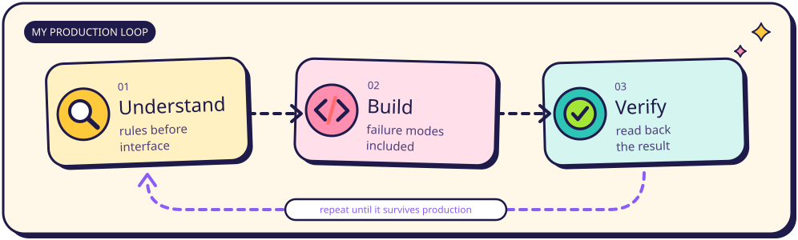
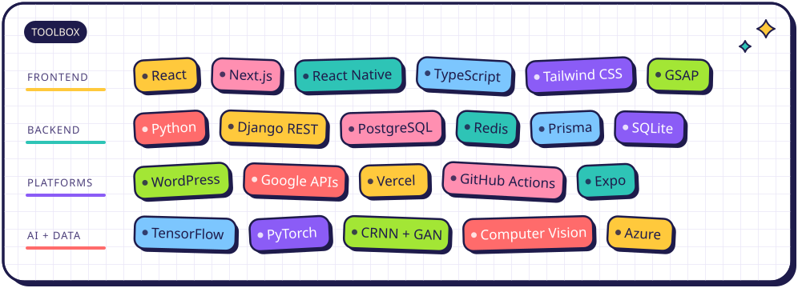
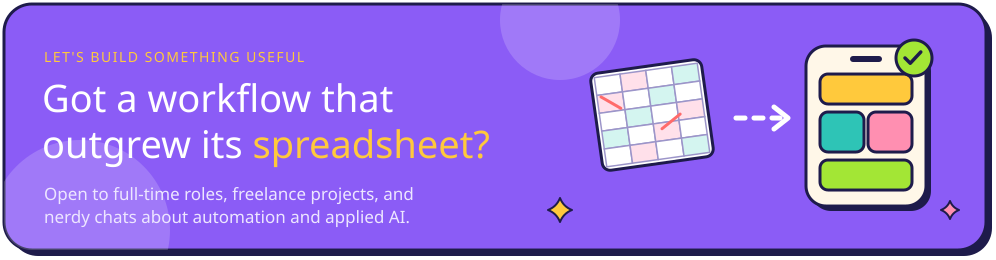

 

I'm a **full-stack developer & automation engineer** from Bataan, Philippines 🇵🇭 — a Cum Laude CS grad (Data Science) who likes the part of the job where requirements get messy: old spreadsheets, inconsistent user input, account migrations, and AI output that still needs a safety check. I map the real rules first, then turn them into software that keeps working after launch day.

- 🛠️ &nbsp;Freelancing on production WordPress, Python automation and Google Workspace APIs for **AGG Doors**
- 🏠 &nbsp;Building **Katiwala**, a home-services marketplace for Filipino households
- 🎓 &nbsp;Best Thesis Paper & Presenter at **IRCITE 2026** for license-plate deblurring research
- 💬 &nbsp;Ask me about: business systems, automation, React / Next.js, Django, and applied AI

### 🚌 &nbsp;Things I've shipped

  
  

  
  

  
  

### 🏆 &nbsp;Shelf of shiny things

### 🐍 &nbsp;My commits, as eaten by a snake

<picture>
  <source media="(prefers-color-scheme: dark)" srcset="https://raw.githubusercontent.com/WrenzLaylo/WrenzLaylo/output/snake-dark.svg" />
  
</picture>

  
  
  
  

Hand-drawn in SVG · every animation on this page is CSS, no external services · <i>salamat sa pagbisita!</i>

